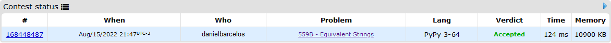

# Contest Problems

**Conteúdo da Disciplina**: Dividir e Conquistar<br>

## Alunos
|Matrícula | Aluno |
| -- | -- |
| 17/0101711  |  Daniel Barcelos Moreira |

## Sobre 
O objetivo do projeto é solucionar alguns problemas de juízes online fazendo o uso de dividir e conquistar.

## Screenshots
### Problema Strings Equivalentes
[Link para o problema](https://codeforces.com/problemset/problem/559/B)


</figcaption>
    Imagem 1: Accepted CodeForces Strings Equivalentes
</figcaption>

### Problema Merge

[Link para o problema](https://codeforces.com/problemset/problem/873/D)


</figcaption>
    Imagem 2: Accepted CodeForces Merge
</figcaption>

## Instalação 
**Linguagem**: Python<br>

## Uso 
- Instale o [python 3](https://www.python.org/downloads/);

```
python3 equivalent.py
python3 merge.py
python3 minmax.py
```


